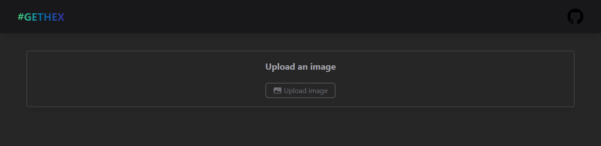

# 🌟 #GetHex

> Extract hex color codes from any image

| #GetHex is a website created with react, designed to simplify the process of extracting hex code colors from images.

## Built With

## 📷 Preview

## Live Site

[Live Site Link](https://gethex.netlify.app/)

## Author

- [@mauroTG](https://www.github.com/mauroTG)
